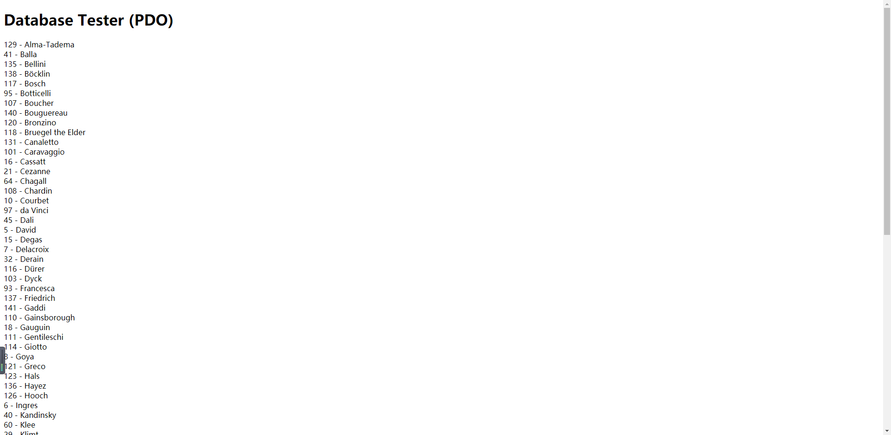
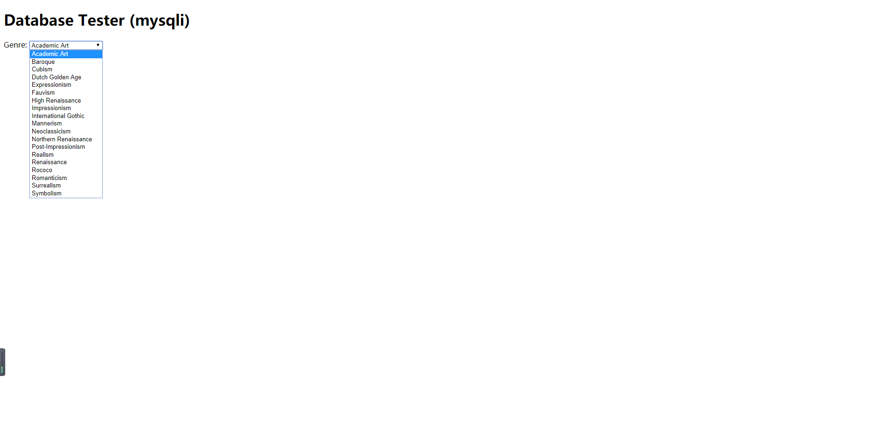
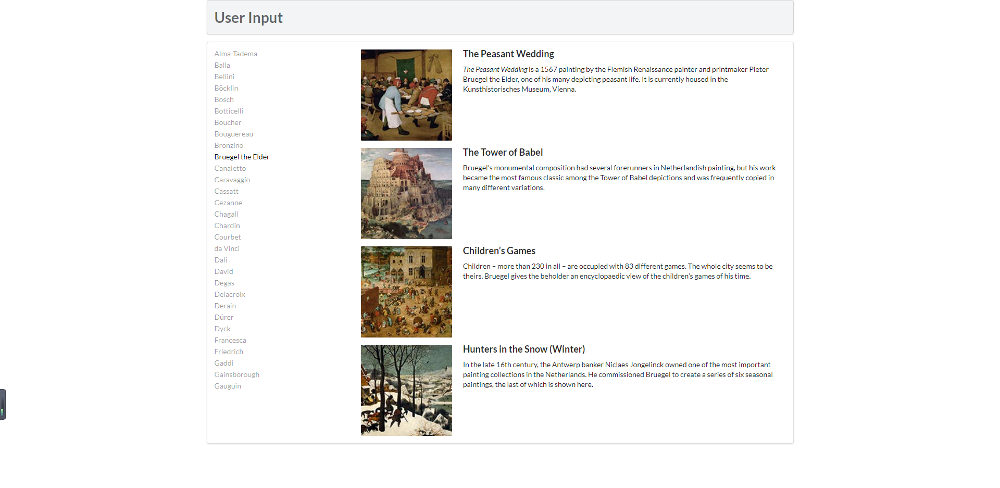
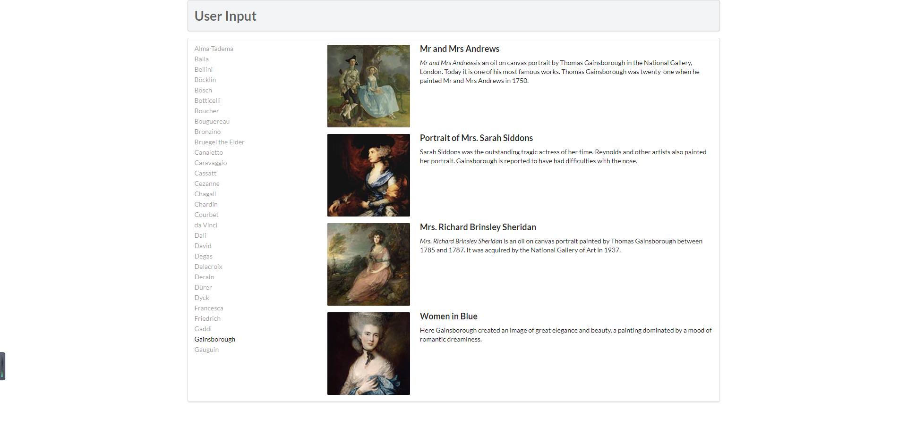

# Lab10设计文档

姓名：俞晓莉

学号：18307130274

## Exercise7: MYSQL THROUGH PHP  

1. **pdo方法连接数据库**

   首先要先连接到art数据库（其中包含了对错误的处理方法：setAttribute、try catch等不作详细介绍），然后在php中进行对数据库的相关操作。

   ```php
   $sql = "select * from Artists order by LastName";
   $result = $pdo->query($sql);
   ```

   这一段做的是，在art数据库中，提取出名为Artists的表中的所有字段，并将它们按照LastName的字典序来排序。并把sql的执行返回给result，后续利用result变量来对数据库中抽取出的结果进行操作。

   ```php
   while ($row = $result->fetch()) {
       echo $row['ArtistID'] . " - " . $row['LastName'] . "<br/>";
   }
   ```

   这里就利用了while循环和fetch函数，循环的每一次获取表里的每一行数据，赋给row变量，在客户端上用echo打印出ArtistID和LastName。这里注意到，由于之前执行sql时规定了按照LastName的字典序排序，所以在输出的相应结果中也可以看到，也是按照相应的字典序进行排列展示的。

   

2. **mysqli方法连接数据库**

   ```php
   $connection = mysqli_connect(DBHOST, DBUSER, DBPASS, DBNAME); 
   if ( mysqli_connect_errno() ) {
      die( mysqli_connect_error() ); 
   }
   ```

   跟pdo一样先连接到art数据库，并进行相应的错误处理。

   ```php
   $sql = "select * from Genres order by GenreName"; 
   ```

   根据GenreName字典序获取Genres表里的所有字段，赋给result。

   ```php
   if ($result = mysqli_query($connection, $sql)) {
     // loop through the data
     while($row = mysqli_fetch_assoc($result)) {
        echo '<option value="' . $row['GenreID'] . '">'; 
        echo $row['GenreName'];
        echo "</option>";
     }
   ```

   利用循环取出所有的GenreName，并把每一项都作为一个option（value值）放在一个select里，如图所示。

   

## Exercise8: INTEGRATING USER INPUTS (PDO) 

1. **outputArtists()**

   主要功能是取出想要的artist的lastname，展示在页面上。

   连接art数据库，select取出根据lastname字典序排序后的前30名artists，赋给result。每一行里的值都显示在一个a标签里，其中，每一个a标签href值设置为当前执行脚本的路径名，id值为表中取出的artistid，class值为item，并根据是否鼠标移到上面设置为active或不设置，最后显示的值为lastname。

2. **outputPaintings()**

   主要功能是根据点击后传来的id，在表中删选出id对应的所有字段，循环显示每一张画家的图片。

   如果点击了相应的a标签，就连接art数据库中，取出paintings表中的所有artistid为传过来的id数组中的数据的字段，赋给result。再根据result的大小进行循环，每一次都调用一次outputSinglePainting($row)方法展示单张图片。

3. **outputSinglePainting($row)**

   主要功能是显示画家的某一张图片。

   echo搭好了基本的html框架，主要php要实现的是获取到img的src，才能显示每一张图片。img的src前一部分是固定的，就是images/art/works/square-medium/，后一部分也是固定的，是.jpg，变化的只是中间的图片名称，所以只需要找到row对应行中的ImageFileName，添补到中间即可。

   后面就是同样获取了row对应行的title和excerpt，用echo进行打印。

   

## Exercise9: PREPARED STATEMENTS 

**截图：**



**执行sql语句的方式：**

1. **statement的execute()方法**

   在不知道sql语句类型的时候，可以用execute()方法来执行sql语句，用这个方法将会返回一个布尔值，如果想要获得执行查询语句的ResultSet对象，需要用到getResultSet()，该方法返回Statement执行查询语句所返回的ResultSet对象；如果是语句影响的record行数，需要用到getUpdateCount()，该方法返回statementDDL,DML语句所影响的记录行数。

2. **statement的executeUpdate()和executeQuery()方法**

   如果可以确定是哪种类型的sql语句，就可以分别用executeUpdate和executeQuery()方法执行。executeQuery()把数据库响应的查询结果存放在ResultSet类对象中返回，executeUpdate()返回statementDDL,DML语句所影响的记录行数。

3. **使用PreparedStatement执行SQL语句**

   使用占位符?代替执行时的值，可以预先进行编译，需要用到时再利用PrepatedStatement提供的一系列setxxx(例如int index方法传入参数值。PreparedStatement接口也实现了statement接口的execute(),executeQuery(),和executeUpdate()方法，但因为SQL语句已经在PreparedStatement对象里，因此不再需要带参数。

   因此PreparedStatement具有以下优点：

　　① PreparedStatement可以预编译SQL语句，性能更好

　　② PreparedStatement无须“拼接”SQL语句

　　③ PreparedStatement可以放置SQL注入