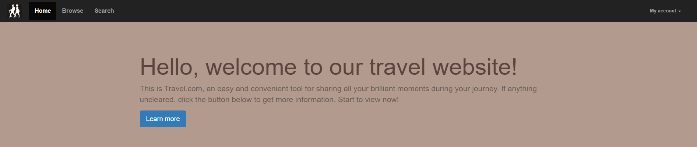
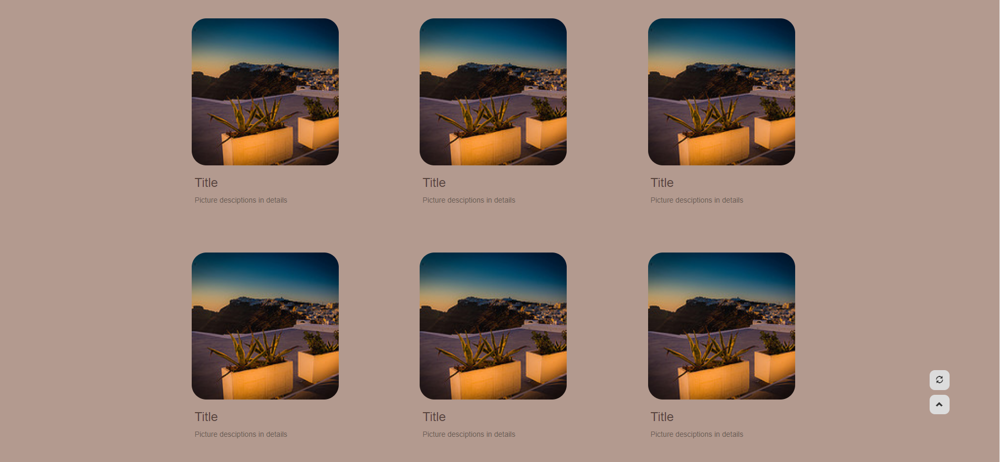

LAB 4 设计文档
==================

姓名：俞晓莉
学号：18307130274

-------------------

##导航栏实现

运用到了Bootstrap中的nav类

考虑到响应式的情况，选用了Bootstrap里支持的.nabvar-collapse

当窗口视角很窄或是在手机等移动端上浏览时，导航条会自动折叠，显示一个三横的“汉堡包”图标样式，点击这个图标即可展开导航栏

账户类My Account位于导航栏的右侧，使用了Bootstrap下拉菜单dropdown

每个菜单项前有相应的图标，由于Bootstrap本身就提供了许多字体图标，这次lab中就直接运用了某些字体图标

-------------------

##巨幕

进入网页后看到的第一段文字

运用了Bootstrap中的jumbotron，在整个浏览器的视口延伸来展示网站的介绍和对用户的相应提示

-------------------

##轮播图插件

使用Bootstrap中的carousel类进行图片的轮播演示

提供了indicators小点提示是第几张图，slide加入图片切换时的过渡和动画效果

-------------------

##缩略图（借助栅格）

网站首页需要展示热门图片及图片的详细信息（标题+描述）

这里使用了Bootstrap的缩略图来实现（栅格系统的扩展）

栅格的columnn-i让每一个图片展示框的宽度一致，调整i的大小就可以调整一行显示几个图片展示框，每个的宽度是多少

-------------------

##网页展示

