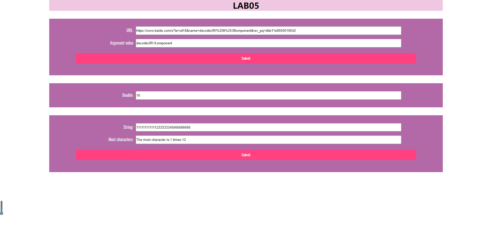

LAB5设计文档
====================

姓名：俞晓莉       
学号：18307130274

----------------------

### 1. 获取url中名为name的参数

我此次采用的是通过写一个有关name参数的正则表达式，并与输入的url进行对比匹配的方式来获取name参数。

先构造有关name的正则表达式，主要是规定中间含有“name”字符串，且用&作为参数与参数之间的分隔符。

```js
var reg = new RegExp("(^|&)"+"name"+"=([^&]*)(&|$)")
```
用于寻找形如：&+name=值+&（&可以不存在）的正则表达式，找到就表示url里含有name参数。

具体的寻找用到了JS中的match函数，通过split取?后的子串，再与写好的reg正则表达式进行match匹配。

届时会match函数返回一个数组，它的第0个元素存放的是匹配到的文本，随后依次存放与正则表达式的子表达式匹配的文本。

根据我们构造的正则表达式，返回数组的第1个元素应该存放"&"（或者是%不存在，则为空字符串），第二个元素就是name参数的具体值。
因此用name[2]就可以取出name参数的值。

考虑到url可能进行过编码，这里对name[2]作解码处理，用到了unescape()和decodeURIComponent()函数，保证最后输出的是解码后的name参数值。

具体代码如下：
```js
function showWindowHref(){
    let reg = new RegExp("(^|&)"+"name"+"=([^&]*)(&|$)");
    let name = url.value.split("?")[1].match(reg);
    if(name!=null)
        url_result.value = unescape(decodeURIComponent(name[2]));
}
```

-----------------------------------------
### 2. 每隔五秒运行一次函数

这道题主要考察的是setInternal()和cleadInterval()的用法。时间的间隔直接根据题目要求设置5*1000即可，重点是有关何时停止的写法。

我这里主要用的是getSeconds，来判断当前秒数是否已经>=55，因为如果>=55，那么接下来一次一定是在整分后，就需要进行停止。

另一个判断条件就是每执行一次，让计数器++，直到>10，停止。

一开始我用的是判断开始的getMinutes()和执行时的getMinutes()是否相等来查看是否进入到了整分。
这样做虽然也可以停止，但仍旧会执行刚刚进入整分后的那一次double，所以就改成了对getMinutes()是否>=55的判断。

具体代码如下：
```js
let mul = document.getElementById("mul");
window.onload = function timeTest(){
    let i=0;
    const interval=setInterval(function(){
        let now=new Date();
        if(now.getSeconds() >= 55||++i>10){
            window.clearInterval(interval);
        }
        console.log(`${i}:${now}`);
        double();
    },5*1000);
}

function double(){
    if(mul.value == "")
        mul.value = "1";
    else
        mul.value *=2;
}
```

--------------------------------------------
### 3. 判断输入框most里出现最多的字符，并统计出来

我这里的做法是先创建一个与输入长度等长的数组，数组的index就是字符，并用一个for循环记录每一个出现过的字符的出现次数。

然后再这个数组里，再用一次for循环找出出现次数最多的字符，和它所对应的出现次数，进行打印即可。

具体代码如下:
```js
let most = document.getElementById("most");
let result = document.getElementById("most-result");
let most_submit = document.getElementById("most_submit");
most_submit.addEventListener('click',arrSameStr);
function arrSameStr(){
    let obj={};
    let arr = most.value;
    for(let i=0;i<arr.length;i++){
        if(!obj[arr.charAt(i)]){
            obj[arr.charAt(i)]=1;
        }else{
            obj[arr.charAt(i)]++;
        }
    }
    let max=0;
    let index='';
    for(let i in obj){
        if(obj[i]>max){
            max=obj[i];
            index=i;
        }
    }
    result.value = "The most character is:" + index + " times:" + max;
}
```

-----------------------------------------
### 相应截图

* 网页效果截图



* Github截图


