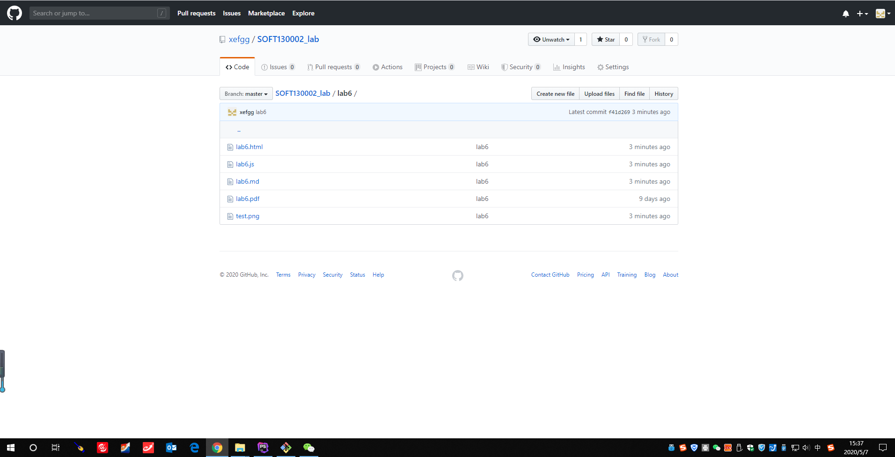
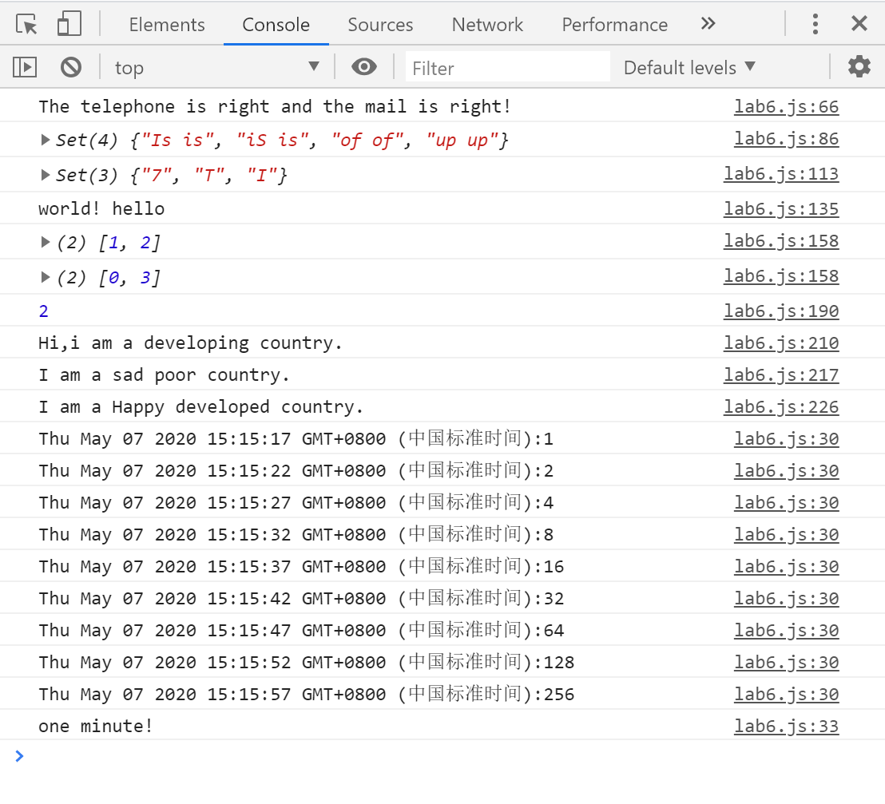

# Lab6设计文档

姓名：俞晓莉

学号：18307130274


## 1. textMail

移动电话正则表达式：

```js
var telreg = /^[1][3,5,7,8][0-9]{9}$/;
```

表示该手机号必须以1为开头，第二位可为3,5,7,8,中的任意一位，后面跟9个0-9的整数，这样保证一共是11位。

邮箱的正则表达式：

```js
var mailreg = /^([a-zA-Z]|[0-9])(\w|\-)+@[a-zA-Z0-9]+\.([a-zA-Z]{2,4})$/;
```

表示邮箱必须由数字字母开头，中间可以是多个数字字母或下划线或“-”，中间必须由“@''符号，后面紧跟数字或字母，接着必须由”.“符号，然后跟着2-4个字母作为结尾。


## 2. testRedundancy

用match函数匹配找到的相邻的字符串。

相邻重复的正则表达式：

```js
let reg = /\b([a-z]+) \1\b/gi;
```

\b表示一个单词匹配的边界，([a-z]+)是匹配一个或多个小写的字母，再加上\1引用了之前那个括号里的内容，就可以达到相邻重复的效果。后面的g和i分别表示全局搜索和不区分大小写。


## 3.继承不同方式的理解

* 构造函数

  通过call、apply方法实现，可以避免引用类型的属性被所有实例共享，子类也可以向父类传递参数，但由于方法都会在构造函数中定义，每一次创建实例就都会创建一遍方法。

* 原型链继承

  通过设置子类的prototype为父类的实例而实现。引用类型的属性会被所有实例共享，且子类的实例不能像父类传参。

* Objetct.create

  通过设置子类的prototype为一个object.create函数来实现，create函数的原型设置为参数传进来的原型。参数的可选让新创建的对象可以制定生成属性对象。


## 4.Map、Set、Array区别与使用

* Map

  map的结构是一组键值对，其中的键与值是互相匹配的，可以通过set方法放入一堆键值对。

* Set

  set和map比较类似，只是set只会存储key值，不存储value值，key是不允许重复的。

* Array

  array就是类似于普通的数组，与java中的array类很相似，都是通过push、pop等操作对数组元素进行增删改查。

  

## Gitgub及本地命令行截图

* github截图



* 本地命令行截图




