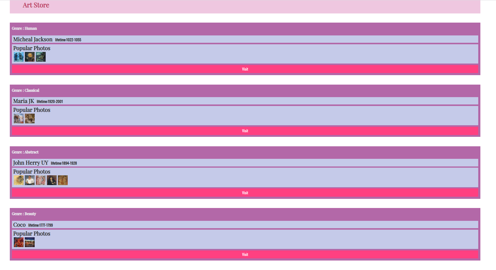

## Lab07 设计文档

姓名：俞晓莉    

学号： 18307130274

-------------------------------------------

### 主要设计思想

先找到需要插入所有元素的类flex-container justify，利用DOM里的createElement()方法创造子对象，在通过相应的js方法改变他们的属性值
（绑定class，设置innerHTML、css样式等），最后运用appendChild()方法将子对象加入到父对象中去。

比如以加入一个h4的标题为例：

先用getElementsByClassName()找到要插入所有元素的原始对象，命名为item。然后创建一个名为div的div对象，给div绑定好class为item
来设置它的css样式。这样就给要插入的h4设置好了它的父级div。然后继续用createElement()创建一个h4对象，设置相应的innerHTML为要显示的内容。
最后将h4对象加入父级div，再将div加入原始对象，就可以显示在网页上了。

这个例子的具体代码：

```js
function add(){
    for(let i=0;i<works.length;i++){
        let item = document.getElementsByClassName('flex-container justify')[0];
        let div = document.createElement("div");
        div.className = 'item';
        let h4 = document.createElement("h4");
        h4.innerHTML = "Genre :" + " " + works[i].tips;
        div.appendChild(h4);
        item.appendChild(div);
    }
}
```

之后要插入的各种子对象都可以按照这个逻辑来插入，就不多赘述了。

-----------------------------------------------

### 遇到的困难及解决方案

* **getElementsByClassName()的返回值问题**

  我在一开始写的时候，在获取item时，就直接用了：

  ```js
  let item = document.getElementsByClassName('flex-container justify');
  ```

  结果在debug时发现console里显示item不具备appendChild()功能。

  后来经过相关资料的查找发现，getElementsByClassName()方法会默认返回一个集合，因此item作为一个集合自然没法调用appendChild()的功能。

  解决方法：

  由于flex-container justify这个类在html中只出现了一次，只需要取返回的集合中的第一个元素，就可以得到我想要的那个div了。

  于是修改上述代码如下：

  ```js
  let item = document.getElementsByClassName('flex-container justify')[0];
  ```

  成功！

* **author和lifetime的并排显示问题**

  题目要求author是h3属性，lifetime是h5属性，这样在默认的情况下是没有办法让他们在同一行里显示的。

  解决方法：

  考虑到了css中的display : inline属性。只要author和lifetime都有这个属性，它们就可以在同一行里显示。因此，在js中分别给他们设置
  style.display为inline即可。

  具体实现（部分代码）如下：

  ```js
          let div2 = document.createElement("div");
          div2.className = 'inner-box';
          let author = document.createElement("h3");
          author.innerHTML = works[i].author;
          author.style.display = "inline";
          div2.appendChild(author);
          let lifetime = document.createElement("h5");
          lifetime.innerHTML = "lifetime:" + works[i].lifetime;
          lifetime.style.display = "inline"
          lifetime.style.marginLeft = "1em";
          div2.appendChild(lifetime);
          div.appendChild(div2);
  ```

----------------------------------------

### 最终网页效果截图



----------------------------------------

